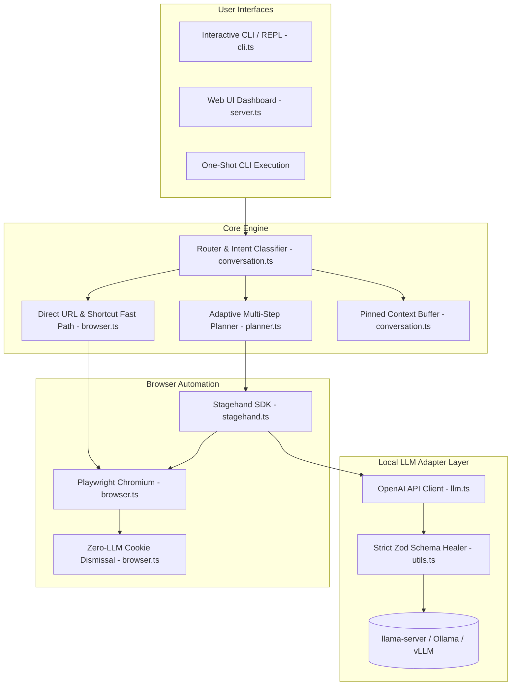

# Stagehand Local 🎭🤖

> Run **[Stagehand](https://github.com/browserbasehq/stagehand)** completely locally using your own LLM (such as `llama-server`, Ollama, vLLM, or LM Studio) with zero cloud AI dependencies.

Stagehand Local combines Playwright with local model inference (optimized for models like Gemma 4 26B, Qwen 2.5 / 3.8 27B) into an interactive, high-performance web agent. It features a modern **Web UI Dashboard**, an **OpenCode-style Interactive CLI**, dynamic multi-step adaptive planning, strict Zod schema self-healing, DOM-level fast paths, zero-LLM cookie dismissal, anti-loop detection, and CSV batch scanning.

---

## 🎯 What It Does

Stagehand Local acts as an autonomous pair-navigator and data-extractor right in your browser or terminal:

- 🌐 **Autonomous Multi-Step Browsing & Adaptive Planning**: Give it a high-level goal (`"go to youtube, search for lo-fi beats, play the first track, and skip 30 seconds in"`), and it will plan, locate interactive DOM elements, click, type, and verify progress. If search results are inconclusive, the agent dynamically adapts its plan and navigates into destination links.
- 🖥️ **Modern Web UI Dashboard**: Run `npm run ui` for a full graphical interface with real-time SSE execution steps, live screenshot viewing, quick extraction, batch URL scanning, and settings management.
- 🔍 **Natural Language Data Extraction**: Point it at any URL and ask a question (`"find all open remote backend roles and salaries"`). Rather than writing fragile CSS/XPath selectors, the agent analyzes the DOM and extracts clean, structured answers.
- 🧠 **Cross-Task Contextual Reasoning**: Features a persistent conversation buffer across commands. You can paste reference documents (like your resume or project specs), have the agent browse multiple websites, and then query it (`think which company is the best fit for my skills?`) to reason over the collected data.
- ⚡ **Zero-Overhead Search & Navigation**: Skips repetitive search engine homepages. Typing `youtube <query>`, `github <query>`, or `google <query>` takes you straight to results without wasting tokens on typing into search inputs.
- 📋 **Batch CSV Web Processing**: Takes a CSV with hundreds of company or candidate URLs, systematically navigates each site, dismisses overlays, extracts target fields, and streams structured output to a new CSV in real time.
- 🛠️ **Developer Inspection REPL**: An interactive CLI to explore the live page: list clickable elements (`observe`), capture screenshots (`screenshot`), switch tabs (`pages`), go back (`back`), and inspect session memory (`context`).

---

## 🖥️ Web UI Dashboard

Stagehand Local includes a built-in, responsive Web UI dashboard built with real-time Server-Sent Events (SSE):

```bash
# Launch Web UI on default port 7788
npm run ui
# or
npx tsx index.ts --ui --port 7788
```

Open your browser at `http://127.0.0.1:7788` to access:
- 🤖 **Agent Goal Runner**: Submit natural language instructions and watch real-time step-by-step execution with live action logs (`navigate`, `click`, `extract`, `done`).
- 📸 **Live Browser Screen Viewer**: Automatic and manual snapshot refresh showing the exact live state of the automated Chromium browser.
- 🔍 **Quick Extract**: Single-click URL data extraction with immediate markdown synthesis.
- 📋 **Batch CSV Scanner**: Upload and run CSV URL lists with real-time table progress and downloadable CSV output.
- ⚙️ **Settings & Hot-Reload**: Modify LLM base URL, model ID, timeouts, DOM settling delays, and cookie patterns directly from the UI without restarting the server.

---

## ⚙️ Modular Architecture

The codebase is organized into clean, single-responsibility TypeScript modules under `src/`:

```
stagehand-local/
├── src/
│   ├── types.ts          # Core TypeScript interfaces (Config, SessionState, PlanAction, BatchResult)
│   ├── config.ts         # Config loader/saver with hot-reload and CLI flag parsing
│   ├── utils.ts          # Zod schema self-healing, JSON cleaner, retry/timeout wrappers, CDP helpers
│   ├── conversation.ts   # Session state buffer, fact-pinning context manager, thinking mode Q&A
│   ├── files.ts          # Inline @file parser, workspace scanner, PDF reader (pdf-parse), editor spawner
│   ├── browser.ts        # Playwright lifecycle, DOM settling, zero-cost cookie dismissal, screenshots
│   ├── llm.ts            # OpenAI client adapter, Stagehand custom model provider & schema prompts
│   ├── planner.ts        # Autonomous multi-step planning loop, adaptive replanning, conclusive evaluator
│   ├── scan.ts           # CSV batch URL extractor with real-time stream processing
│   ├── cli.ts            # OpenCode-style interactive REPL, @ autocomplete, bracketed paste
│   └── server.ts         # Fast HTTP & SSE Web UI server with live screen preview
├── index.ts              # Clean, unified CLI & Web UI entry point
├── config.json           # Default configuration (LLM, browser, heuristics, shortcuts)
└── package.json
```



---

## 🧩 Advanced Features & Resilience

### 1. Strict Zod Schema Self-Healing
Stagehand enforces strict Zod schemas (`z.strictObject(...)`) across all internal operations (`act`, `extract`, `observe`). Quantized local models frequently return extra fields (like `action`, `twoStep`) or schema reflection echoes (`{"$schema": "...", "properties": {...}}`). 

Stagehand Local's adapter in `src/utils.ts` automatically:
- Strips unallowed keys and filters properties strictly against the target schema.
- Normalizes types (e.g. converting nested objects or arrays to expected string formats).
- Generates compliant defaults if a model echoes raw schema metadata, completely eliminating `unrecognized_keys` and `invalid_type` crashes.

### 2. Dynamic Adaptive Planning & Conclusive Recovery
When searching or browsing complex sites, models sometimes extract incomplete intermediate artifacts (like search engine result snippets or numeric references) and conclude prematurely.

Stagehand Local's `synthesize()` evaluator inspects the extraction:
- If the result is inconclusive or notes missing data (e.g. *"cannot determine from search snippet"*), it marks `isComplete: false`.
- The planner dynamically adapts its plan, clicks the organic search result, and navigates into the destination website (e.g. `roboflow.com/careers`) to find the actual answer before concluding.

### 3. Zero-LLM Cost Cookie & Overlay Dismissal
Standard web agents waste 1–2 expensive LLM calls per page on cookie banners. Stagehand Local executes an in-page DOM script (`page.evaluate`) immediately upon navigation that matches button text against configurable patterns (`Accept all`, `I agree`, `Got it`, `Allow all`). Overlays disappear in <50ms at zero token cost.

### 4. CDP Resiliency & DOM Settling
Modern SPAs constantly hydrate and detach frames during load. Stagehand Local includes configurable DOM settling buffers (`domSettleMs: 1500`), lifecycle synchronizations (`domcontentloaded`), and exponential backoff retry wrappers on all Playwright CDP operations.

### 5. Fact-Pinning Context Manager
- **Pinned Facts**: Attached files (`@file`, `/attach`) and the most recent page extraction are locked with `pinned: true` and are never evicted.
- **Selective Pruning**: Transient chit-chat and stale history are pruned when exceeding the context budget (`contextWindowChars: 24000`, ~6,000 tokens), with explicit budget warnings.
- **Deduplication**: Automatically detects overlapping text pastes (>60% similarity) and replaces previous entries in-place.

---

## 📋 Prerequisites

1. **Node.js**: `v18+` (v20+ or v22 recommended).
2. **Local LLM Server**: Any OpenAI-compatible API running locally.

### Recommended Local LLM Server Configurations

#### A. Gemma 4 26B (via `llama-server`)
```bash
llama-server \
  -hf unsloth/gemma-4-26B-A4B-it-GGUF:UD-IQ4_XS \
  -hfd unsloth/gemma-4-26B-A4B-it-GGUF:MTP-Q8_0.gguf \
  --no-mmproj --spec-draft-n-max 2 --spec-draft-p-min 0.6 \
  --host 0.0.0.0 --port 8080 --jinja -c 65536 -np 1 \
  --n-gpu-layers 99 --flash-attn on --cache-type-k q4_0 --cache-type-v q4_0 \
  --temp 1.0 --top-p 0.95 --top-k 64 --repeat-penalty 1.0 \
  --reasoning-format deepseek --reasoning-budget 4096
```

#### B. Qwen 2.5 / 3.8 27B (via `llama-server`)
```bash
llama-server \
  -m path/to/Qwen2.5-32B-Instruct-Q4_K_M.gguf \
  --port 8080 \
  --ctx-size 16384 \
  --n-gpu-layers 99 \
  --flash-attn on
```

*Also fully compatible with Ollama (`ollama serve`), LM Studio (`http://127.0.0.1:1234/v1`), or vLLM.*

---

## 🚀 Quick Start

### 1. Install Dependencies & Chromium
```bash
npm install
npx playwright install chromium
```

### 2. Verify Configuration (`config.json`)
Ensure your LLM endpoint and model ID match your running server:
```json
{
  "llm": {
    "baseURL": "http://127.0.0.1:8080/v1",
    "modelId": "unsloth/gemma-4-26B-A4B-it-GGUF:UD-IQ4_XS"
  }
}
```

### 3. Launch

**Web UI Dashboard Mode**:
```bash
npm run ui
# or: npx tsx index.ts --ui --port 7788
```

**Interactive CLI REPL Mode**:
```bash
npm run cli
# or: npx tsx index.ts -i
```

**One-Shot CLI Prompt**:
```bash
npx tsx index.ts "https://news.ycombinator.com what is the top story right now?"
```

**Headless One-Shot Mode**:
```bash
npx tsx index.ts --headless "https://github.com/trending what are the top 3 repos?"
```

---

## 💻 CLI Options & Flags

| Flag / Option | Description |
|---|---|
| `--ui` | Launch the Web UI dashboard on localhost |
| `--port <number>` | Port for the Web UI server (default: `7788`) |
| `-i`, `--interactive` | Start interactive CLI REPL mode |
| `--headless` | Run browser in headless mode (overrides config) |
| `--headed`, `--no-headless` | Run browser in headed mode with visible Chromium window |
| `-c <path>`, `--config <path>` | Specify custom JSON configuration file path |
| `-h`, `--help` | Show CLI usage and command options |
| `"<instruction>"` | Run one-shot prompt in single execution mode and exit |

---

## 🕹️ Interactive CLI (OpenCode-Style REPL)

The interactive CLI includes rich developer ergonomics:

### 📎 Attaching Files & Tab Autocompletion (`@`)
Type `@` and press `Tab` to search and attach local workspace files:
```text
[about:blank] > think compare @res[Tab]
[about:blank] > think compare @Resume_2026.pdf
📎 Attached "Resume_2026.pdf" (1,420 words / 8.5 KB) to session context.
```
- **Supported Formats**: `.pdf` (via bundled `pdf-parse`), `.docx`/`.rtf` (macOS textutil), `.txt`, `.md`, `.json`, `.csv`, `.ts`, `.js`, `.py`.
- **Workspace Indexing**: Automatically indexes files while ignoring `node_modules`, `.git`, `.next`, etc.

### ⌨️ Keybinds & Composer Controls
- **`Enter`**: Submit prompt for execution.
- **`Shift+Enter` / `Alt+Enter`**: Insert newline for multiline drafting without submitting.
- **`Tab`**: Autocomplete `@files`, `/commands`, or search shortcuts (`youtube`, `google`, `github`).
- **Bracketed Paste**: Paste 100+ lines (resumes, JSON, markdown) as a single clean input block.
- **`/edit`**: Open your system `$EDITOR` (`nano`, `vim`, `code`) to draft complex instructions.

### 📖 CLI Command Reference

| Command | Syntax | Description |
|---|---|---|
| **`@file`** | `@resume.pdf` / `think @file` | Attach file inline to session context |
| **`/attach`** | `/attach <path>` | Attach file directly to session memory |
| **`/files`** | `/files` | List all currently attached files and word counts |
| **`/edit`** | `/edit` / `/e` | Draft/edit multi-line prompt in external `$EDITOR` |
| **`/paste`** | `/paste` / `"""` | Dedicated multi-line capture block (submit with `"""` or `EOF`) |
| **`goto`** | `goto <url>` | Navigate the current page to the specified URL |
| **`act`** | `act <instruction>` | Perform a browser action (`act click on the Apply button`) |
| **`extract`** | `extract <instruction>` | Extract specific data or text from the current page |
| **`observe`** | `observe [instruction]` | Discover interactive DOM elements and their selectors |
| **`screenshot`** | `screenshot [file.png]` | Capture a PNG screenshot of the current page |
| **`think` / `ask`** | `think <question>` | Query the LLM using accumulated session context (no web calls) |
| **`context`** | `context` | Inspect all stored extractions, answers, and documents |
| **`scan`** | `scan <csv> <col> "instr" [out.csv]` | Batch scan URLs from a CSV file |
| **`save`** | `save [file.txt]` | Save the last extraction or answer to disk |
| **`pages`** | `pages` | List all open browser tabs and their URLs |
| **`back`** | `back` | Navigate back in browser history |
| **`url`** | `url` | Show current page title and URL |
| **`history`** | `history` | View action and navigation history in this session |
| **`exit` / `quit`** | `exit` / `quit` / `q` | Close browser and quit |

---

## 📊 Batch CSV Scanning

Automate data extraction across hundreds of websites via CLI or Web UI:

```text
Stagehand> scan outreach.csv careers_url "Are there open remote engineering roles? List titles." results.csv
```

- Reads `outreach.csv`.
- Navigates to each URL in `careers_url`.
- Dismisses cookie overlays and extracts target data.
- Appends clean structured output into `results.csv` in real-time.

---

## ⚙️ Configuration Reference (`config.json`)

```json
{
  "llm": {
    "baseURL": "http://127.0.0.1:8080/v1",
    "apiKey": "not-needed",
    "modelId": "unsloth/gemma-4-26B-A4B-it-GGUF:UD-IQ4_XS",
    "temperature": 0.1,
    "stepTimeoutMs": 90000
  },
  "browser": {
    "headless": false,
    "defaultTimeout": 30000
  },
  "agent": {
    "maxSteps": 10,
    "maxRetries": 2,
    "domSettleMs": 1500,
    "postActionMs": 800,
    "synthesize": true,
    "contextWindowChars": 24000
  },
  "shortcuts": {
    "youtube": "https://www.youtube.com/results?search_query={{query}}",
    "google": "https://www.google.com/search?q={{query}}",
    "github": "https://github.com/search?q={{query}}&type=repositories",
    "hn": "https://hn.algolia.com/?q={{query}}",
    "npm": "https://www.npmjs.com/search?q={{query}}"
  },
  "cookieDismiss": [
    "Accept all",
    "Accept all cookies",
    "Accept cookies",
    "I agree",
    "Got it",
    "Allow all",
    "Close"
  ]
}
```

### Environment Variable Overrides

| Variable | Description | Example |
|---|---|---|
| `HEADLESS` | Run browser in headless mode (`true` / `false`) | `HEADLESS=true` |
| `LLAMA_BASE_URL` | Override LLM base API URL | `LLAMA_BASE_URL=http://localhost:11434/v1` |
| `MODEL_ID` | Override LLM model name | `MODEL_ID=unsloth/gemma-4-26B-A4B-it-GGUF:UD-IQ4_XS` |
| `MAX_STEPS` | Max agent steps before terminating | `MAX_STEPS=15` |

---

## 🛠️ Diagnostics & POSIX Exit Codes

When called as a subprocess in automation pipelines, Stagehand Local adheres to standard exit codes:

| Exit Code | Classification | Condition |
|---|---|---|
| `0` | **Success** | Instruction successfully resolved, extraction returned, or navigation complete. |
| `1` | **Failure / Timeout** | Browser action failed, empty extraction, step limit reached, or anti-loop circuit breaker triggered. |
| `2` | **CDP / Network Error** | Playwright Chromium binary missing, CDP protocol error, websocket failure, or network connection refused. |

---

## 📜 License

ISC License. Built on top of [Stagehand](https://github.com/browserbasehq/stagehand) by Browserbase.
