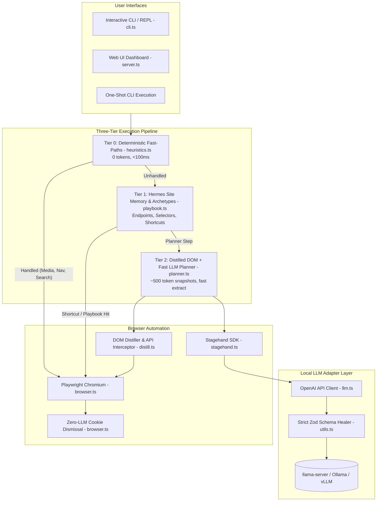

# Stagehand Local 🎭🤖

> Run **[Stagehand](https://github.com/browserbasehq/stagehand)** completely locally using your own LLM (such as `llama-server`, Ollama, vLLM, or LM Studio) with zero cloud AI dependencies.

Stagehand Local combines Playwright with local model inference (optimized for models like Gemma 4 26B, Qwen 2.5 / 3.8 27B) into an interactive, high-performance web agent. It features a modern **Web UI Dashboard**, an **OpenCode-style Interactive CLI**, dynamic multi-step adaptive planning, strict Zod schema self-healing, DOM-level fast paths, zero-LLM cookie dismissal, anti-loop detection, and CSV batch scanning.

---

## 🎯 What It Does

Stagehand Local acts as an autonomous pair-navigator and data-extractor right in your browser or terminal:

- 🌐 **Autonomous Multi-Step Browsing & Adaptive Planning**: Give it a high-level goal (`"go to youtube, search for lo-fi beats, play the first track, and skip 30 seconds in"`), and it will plan, locate interactive DOM elements, click, type, and verify progress. If search results are inconclusive, the agent dynamically adapts its plan and navigates into destination links.
- 🖥️ **Modern Web UI Dashboard**: Run `npm run ui` for a full graphical interface with real-time SSE execution steps, live screenshot viewing, quick extraction, batch URL scanning, and settings management.
- 🔍 **Natural Language Data Extraction**: Point it at any URL and ask a question (`"find all open remote backend roles and salaries"`). Rather than writing fragile CSS/XPath selectors, the agent analyzes the DOM and extracts clean, structured answers.
- 🧠 **Cross-Task Contextual Reasoning**: Features a persistent conversation buffer across commands. You can paste reference documents (like your resume or project specs), have the agent browse multiple websites, and then query it (`think which company is the best fit for my skills?`) to reason over the collected data.
- ⚡ **Zero-Overhead Search & Navigation**: Skips repetitive search engine homepages. Typing `youtube <query>`, `github <query>`, or `google <query>` takes you straight to results without wasting tokens on typing into search inputs.
- 📋 **Batch CSV Web Processing**: Takes a CSV with hundreds of company or candidate URLs, systematically navigates each site, dismisses overlays, extracts target fields, and streams structured output to a new CSV in real time.
- 🛠️ **Developer Inspection REPL**: An interactive CLI to explore the live page: list clickable elements (`observe`), capture screenshots (`screenshot`), switch tabs (`pages`), go back (`back`), and inspect session memory (`context`).

---

## 🖥️ Web UI Dashboard

Stagehand Local includes a built-in, responsive Web UI dashboard built with real-time Server-Sent Events (SSE):

```bash
# Launch Web UI on default port 7788
npm run ui
# or
npx tsx index.ts --ui --port 7788
```

Open your browser at `http://127.0.0.1:7788` to access:
- 🤖 **Agent Goal Runner**: Submit natural language instructions and watch real-time step-by-step execution with live action logs (`navigate`, `click`, `extract`, `done`).
- 📸 **Live Browser Screen Viewer**: Automatic and manual snapshot refresh showing the exact live state of the automated Chromium browser.
- 🔍 **Quick Extract**: Single-click URL data extraction with immediate markdown synthesis.
- 📋 **Batch CSV Scanner**: Upload and run CSV URL lists with real-time table progress and downloadable CSV output.
- ⚙️ **Settings & Hot-Reload**: Modify LLM base URL, model ID, timeouts, DOM settling delays, and cookie patterns directly from the UI without restarting the server.

---

## ⚙️ Modular Architecture

The codebase is organized into clean, single-responsibility TypeScript modules under `src/`:

```
stagehand-local/
├── src/
│   ├── types.ts          # Core TypeScript interfaces (Config, SessionState, PlanAction, BatchResult)
│   ├── config.ts         # Config loader/saver with hot-reload and CLI flag parsing
│   ├── utils.ts          # Zod schema self-healing, JSON cleaner, retry/timeout wrappers, CDP helpers
│   ├── conversation.ts   # Session state buffer, fact-pinning context manager, thinking mode Q&A
│   ├── files.ts          # Inline @file parser, workspace scanner, PDF reader (pdf-parse), editor spawner
│   ├── browser.ts        # Playwright lifecycle, DOM settling, zero-cost cookie dismissal, screenshots
│   ├── distill.ts        # In-browser DOM distillation, SPA API interception, fast extract & snapshot builder
│   ├── heuristics.ts     # Tier 0: Zero-LLM deterministic fast paths (media, search, navigation)
│   ├── playbook.ts       # Tier 1: Hermes site memory, archetype fingerprinting & auto-learning
│   ├── llm.ts            # OpenAI client adapter, Stagehand custom model provider & schema prompts
│   ├── planner.ts        # Autonomous multi-step planning loop, adaptive replanning, conclusive evaluator
│   ├── scan.ts           # CSV batch URL extractor with real-time stream processing
│   ├── cli.ts            # OpenCode-style interactive REPL, @ autocomplete, bracketed paste
│   └── server.ts         # Fast HTTP & SSE Web UI server with live screen preview
├── data/
│   └── playbooks.json    # Persisted domain playbooks, verified endpoints, and selectors
├── index.ts              # Clean, unified CLI & Web UI entry point
├── config.json           # Default configuration (LLM, browser, heuristics, shortcuts)
└── package.json
```



---

## 🧩 Advanced Features & Resilience

### 1. Strict Zod Schema Self-Healing
Stagehand enforces strict Zod schemas (`z.strictObject(...)`) across all internal operations (`act`, `extract`, `observe`). Quantized local models frequently return extra fields (like `action`, `twoStep`) or schema reflection echoes (`{"$schema": "...", "properties": {...}}`). 

Stagehand Local's adapter in `src/utils.ts` automatically:
- Strips unallowed keys and filters properties strictly against the target schema.
- Normalizes types (e.g. converting nested objects or arrays to expected string formats).
- Generates compliant defaults if a model echoes raw schema metadata, completely eliminating `unrecognized_keys` and `invalid_type` crashes.

### 2. Dynamic Adaptive Planning & Conclusive Recovery
When searching or browsing complex sites, models sometimes extract incomplete intermediate artifacts (like search engine result snippets or numeric references) and conclude prematurely.

Stagehand Local's `synthesize()` evaluator inspects the extraction:
- If the result is inconclusive or notes missing data (e.g. *"cannot determine from search snippet"*), it marks `isComplete: false`.
- The planner dynamically adapts its plan, clicks the organic search result, and navigates into the destination website (e.g. `roboflow.com/careers`) to find the actual answer before concluding.

### 3. Zero-LLM Cost Cookie & Overlay Dismissal
Standard web agents waste 1–2 expensive LLM calls per page on cookie banners. Stagehand Local executes an in-page DOM script (`page.evaluate`) immediately upon navigation that matches button text against configurable patterns (`Accept all`, `I agree`, `Got it`, `Allow all`). Overlays disappear in <50ms at zero token cost.

### 4. CDP Resiliency & DOM Settling
Modern SPAs constantly hydrate and detach frames during load. Stagehand Local includes configurable DOM settling buffers (`domSettleMs: 1500`), lifecycle synchronizations (`domcontentloaded`), and exponential backoff retry wrappers on all Playwright CDP operations.

### 5. Fact-Pinning Context Manager
- **Pinned Facts**: Attached files (`@file`, `/attach`) and the most recent page extraction are locked with `pinned: true` and are never evicted.
- **Selective Pruning**: Transient chit-chat and stale history are pruned when exceeding the context budget (`contextWindowChars: 24000`, ~6,000 tokens), with explicit budget warnings.
- **Deduplication**: Automatically detects overlapping text pastes (>60% similarity) and replaces previous entries in-place.

### 6. DOM Distillation & Fast Extraction (70%–90% Token Reduction)
When running on local hardware (e.g., Apple Silicon unified memory), evaluating large prompts is a major performance bottleneck: processing 10,000–30,000 tokens from raw HTML or Stagehand's full CDP Accessibility tree takes 15–30 seconds, balloons the KV cache, and causes swap thrashing or timeouts. Stagehand Local introduces a multi-tier distillation and extraction engine in `src/distill.ts` and `src/planner.ts`:

- **Deep In-Browser DOM Distillation (`distillPage`)**:
  - Runs inside the browser via `page.evaluate()` in ~10–25ms across any modern or legacy website.
  - **Structural Container-First Extraction**: Targets logical record containers first (`tr`, `li`, `article`, `[role="row"]`, `[role="article"]`, `[class*="card"]`, `[class*="item"]`, `p`, `blockquote`). Keeps composite records (e.g., story title + author + points + comments, or job title + department + location) intact as atomic units instead of scattering them into isolated leaf fragments.
  - **Table Column Alignment**: Formats table rows (`<tr>`) with clean `col1 | col2 | col3` cell separators, keeping column structures aligned for local LLM evaluation.
  - **Child Deduplication & Noise Filtering**: Skips headers, navigation bars (`<nav>`), footers (`<footer>`), and child elements whose parent container was already captured.
  - **Universal Visible Text Fallback**: If structured container extraction yields less than 150 characters (e.g. custom Web Components, canvas wrappers, unusual frameworks), it automatically falls back to clean visible text from `main`, `#content`, `[role="main"]`, or `document.body`. Completely eliminates `~0 tokens` distillation failures.
  - Generates up to **12,000 characters** (~3,000 tokens) across up to 150 content blocks in a single distilled snapshot.

- **MiniSearch Pre-Extraction Filter (`rankDistilledBlocks`)**:
  - Automatically indexes distilled text blocks using in-memory full-text search (`minisearch` with `prefix: true` and `fuzzy: 0.2`).
  - **Document Order Preservation**: For broad extractions (`all`, `list`, `stories`, `jobs`, `roles`, `top`, `table`), preserves blocks in their **exact DOM document order**. For specific keyword searches, re-sorts matched blocks by original document index (`id`), ensuring rankings, row alignment, and narrative context are never shuffled.
  - Slices relevant blocks into `fastExtract()`, reducing prompt size from thousands of characters down to **~180–400 tokens** for lightning-fast, hallucination-free evaluation on Gemma 4.

- **Structural Extraction Self-Verification (`isExtractionValid`)**:
  - Inspects extracted JSON arrays to verify data integrity. Rejects empty, trivial, ID-only, or degraded extractions where primary fields (e.g. `title`, `name`, `role`) are mostly `"N/A"`, `"Unknown"`, `"null"`, or empty, automatically triggering retries or escalation rather than accepting hallucinated data.

- **Dedicated Google SERP Distiller (`distillGoogleSearch`)**:
  - Extracts Google Search results without injecting ads, related searches, tracking parameters, or footer bloat.
  - **Opportunistic Zero-Hop Completion**: Inspects visible Google AI Overviews and Featured Snippets (`div[data-attrid="wa:/description"]`, `div.LGOjhe`). If the snippet conclusively answers factual questions (e.g. definitions, dates, facts), the agent completes immediately in step 1 (0 extra navigations, ~120 tokens).
  - **Clean Organic Results**: Extracts top 7 organic results (Title + destination URL). Drops SERP planner prompt size from ~800 tokens to **~120 tokens**, allowing the planner to navigate directly (`{"action":"navigate","url":"https://roboflow.com/careers"}`) or click by title instead of executing fragile, deep XPath selectors.

- **Resilient Multi-Tier Fallback Extraction (`extractText`)**:
  - Eliminates local LLM timeouts that occur when falling back to Stagehand's 30,000-token full AXTree dump:
    1. **Tier 1 (Distilled Fast Extract)**: Ingests top ranked distilled content and intercepted API responses. Succeeds in ~1–2s on 90%+ of pages.
    2. **Tier 2 (Scoped Locator Extract)**: If distillation was partial, dynamically locates the primary content container (`main`, `#content`, `#main-content`, `.jobs`, `.careers`, `[role="main"]`, `article`, `section`) and scopes Stagehand's extract using `page.locator(mainSelector)` and `{ selector }`.
    3. **Tier 3 (Direct In-Browser Text Extract)**: Pulls up to 15,000 characters of visible DOM `innerText` from main content containers and feeds it directly to the local model, completely bypassing AXTree serialization.
    4. **Unscoped Fallback Guard**: Strictly rejects bare unscoped full-page AXTree dumps to guarantee local inference stability.

- **Network & SPA State Interception (`setupApiInterceptor`)**: Injects an in-browser hook via `page.addInitScript()` to capture XHR and `fetch` requests matching internal JSON endpoints (`/api/`, `/v1/`, `/graphql`, `.json`), as well as SPA globals (`window.__NEXT_DATA__`, `window.ytInitialData`). Modern SPAs return clean JSON (200–500 tokens) that completely bypasses DOM evaluation.
- **Fast Extract Path (`fastExtract`)**: Runs extraction prompts against distilled markdown or captured JSON instead of invoking Stagehand's full accessibility tree serializer. Executes in ~1–2s with 10x faster prefill.
- **Planner Page Snapshots (`buildPlannerSnapshot`)**: Injects a compact snapshot of visible interactive controls, organic search results, and page headings directly into each planner step prompt (~500 tokens), giving the planner exact visibility into page state without guessing.

### 7. Three-Tier Execution Pipeline & Telemetry
To completely eliminate unnecessary prompt evaluations and prevent memory pressure on local hardware, Stagehand Local uses a tiered decision engine with automated telemetry:

- **Tier 0: Deterministic Fast-Paths & State Machine (`src/heuristics.ts`, `src/compiler.ts`) — 0 Tokens, <100ms**
  - **$t=0$ Structured Goal Compiler (`src/compiler.ts`)**: Compiles raw natural language goals once at step 0 into a typed `ExecutionPlan` contract with Zod schema validation. Automatically extracts primary search queries while preserving identifying entities (e.g. song titles, artist names, company names) and compound instructions (e.g. `timeOffsetSeconds: 60`, `isAbsoluteSeek: true`). Eliminates multi-step planning hallucinations.
  - **BM25 / Fuzzy Scored Candidate Selection (`clickBestMatchingCard`)**: Eliminates blind `.first()` clicks on YouTube and SERP pages. Scrapes candidate cards in-browser (<15ms) and builds an in-memory `MiniSearch` index across titles and channel names, clicking the candidate with the highest keyword relevance (e.g. matching official music videos over unrelated playlist intros or ads).
  - **Strict State-Gated Action Dispatcher**: Media seeking and skipping are strictly state-gated to verified watch pages (`youtube.com/watch` or `/video/`). Pre-action state gates reject any seek attempt on search results pages (`youtube.com/results`, `google.com/search`) and redirect execution to candidate card matching until the page transition completes.
  - **CDP Lifecycle Synchronization**: Replaced un-awaited raw `page.goto` calls with `navigate(page, url)` and `waitForURL(/.*watch\?v=.*/)`, ensuring `domcontentloaded` and network idle states settle before CDP evaluations execute. Eliminates `-32001 Session with given id not found` disconnect errors.
  - **Delta-State Verified YouTube Ad Skipping & 3-Attempt Escalation**:
    - **16x Playback Acceleration**: Automatically sets ad video `playbackRate = 16` and `muted = true`, clearing 5s countdowns in **~312ms** and 15s unskippable ads in **~900ms**.
    - **Dual-Mode Native CDP Click**: Dispatches full synthetic pointer/mouse events and executes native Playwright hardware-level mouse clicks (`page.mouse.click(x, y)` with `isTrusted: true`) using bounding boxes, bypassing player synthetic event shields.
    - **Accurate Ad State vs. Lingering Container Disambiguation**: Cross-references player API (`player.getVideoData().isAd`, `player.getAdState()`) and visible overlay dimensions to eliminate false-positive loops on persistent empty ad containers.
    - **Content Protection**: Strictly guards against seeking content videos and locks `playbackRate = 1.0` and `muted = false` upon ad completion.
    - **Attempt 1 Diagnostic Dump**: Logs ad candidate metadata (`🔍 AD DEBUG`) and captures `debug-ad-*.png` screenshots immediately on attempt 1.
    - **3-Attempt Escalation**: If ad skipping does not succeed within 3 attempts, automatically yields control to the Tier 2 LLM planner.
  - **Universal Interstitial Recovery Protocol (`src/interstitial.ts`)**:
    - **Viewport Occlusion & Pointer-Event Diagnostics**: Probes viewport center with `document.elementFromPoint()` to detect fixed/absolute high-z overlays, modals, and pre-roll ads blocking interactions.
    - **Time-Aware Countdown Waiting**: Detects active countdowns ("Skip in 5s", "Wait 3s") and waits until either the timer expires or a skip/dismiss action becomes enabled.
    - **4-Tier Escalation Ladder**:
      1. *Tier 1 (Semantic Escape)*: Dispatches keyboard `Escape` event to dismiss standard native dialogs.
      2. *Tier 2 (Action Word Scan)*: Detects and clicks action buttons (`"Skip"`, `"Close"`, `"Dismiss"`, `"No thanks"`, `"Got it"`).
      3. *Tier 3 (Geometric Coordinate Hunting)*: Clicks the top-right / top-left corner zone of the blocking overlay to dismiss custom/SVG modals without text or labels.
      4. *Tier 4 (Surgical Guillotine)*: Removes high-z overlay DOM nodes and resets `document.body.style.overflow = "auto"` to unlock scrolling without breaking page layout.
  - **Google SERP Fast-Hop**: On Google Search pages, checks for visible direct answers or automatically resolves the first clean organic result (`page.locator('#search a[href^="http"]:not([href*="google.com"])').first()`) and fast-hops directly into the destination URL (`continueLoop: true`), completely bypassing the LLM planner.
  - **Loop-Immune Semantic Navigation (`trySemanticNavigation`)**:
    - **URL Stripping**: Strips hostnames/URLs from instructions before matching keywords so domain names (e.g. `news.ycombinator.com`) never falsely trigger navigation heuristics.
    - **Inquiry Exclusion**: Bypasses semantic navigation when the goal is an extraction or question (`what`, `which`, `extract`, `how many`, `think which`, etc.).
    - **`isAlreadyOnTargetPage` Guard**: Skips navigation if current URL already satisfies the target (`/careers`, `/jobs`, `/pricing`, `/docs`, etc.).
    - **In-Page Anchor & Hash Filter**: Ignores links pointing to the same page or `#hash` anchors (e.g. `#jobs`).
    - **Delta-State Verification**: Verifies `urlAfter !== urlBefore` after clicking before claiming success.
    - **Per-Domain Target Dedup**: Ensures a semantic target is visited at most once per domain in a session.
- **Tier 1: Hermes Site Memory & Archetype Detection (`src/playbook.ts`)**
  - **Direct ATS API Fast-Path (<200ms, 0 DOM tokens)**: When visiting or linking to modern ATS providers (**Ashby**, **Greenhouse**, **Lever**), the agent intercepts or scans for ATS endpoints and fetches the complete job board via public REST APIs (`api.ashbyhq.com/posting-api/job-board/{org}`, `boards-api.greenhouse.io/v1/boards/{org}/jobs`, `api.lever.co/v0/postings/{org}`). Completely bypasses DOM rendering and prompt generation.
  - **Deep ATS Script & Global Detection (`findAtsUrlOnPage`)**: Detects script-based ATS embeds (e.g. `<script src="https://jobs.ashbyhq.com/<org>/embed">`), window globals (`window.ashby.settings.ashbyBaseJobBoardUrl`), and inline script API URLs on corporate careers pages (e.g. Roboflow).
  - **Persistent Site Playbooks (`data/playbooks.json`)**: Tracks visited domains, historical success rates, verified selectors, and direct URL shortcuts.
  - **SPA API Endpoint Memory**: When Stagehand intercepts internal JSON endpoints (e.g. Job board endpoints, catalog APIs), it indexes them to the site's playbook for instant retrieval on future visits.
  - **Master Archetype Fingerprinting**: Includes built-in archetype templates (e.g., ATS/Careers: Lever, Greenhouse, Ashby; E-Commerce: Shopify; Media: YouTube). In-browser fingerprinting evaluates DOM signals, script paths, and globals (`window.__NEXT_DATA__`, `window.Shopify`, `window.ytInitialData`). When a site matches ≥2 signals, it automatically inherits known selectors and endpoints.
  - **Autonomous Auto-Learning**: Automatically updates domain records upon every successful extraction or task completion.
- **Tier 2: Distilled DOM + Fast Local LLM Planning (`src/planner.ts`)**
  - When heuristics and playbook shortcuts do not apply, the agent falls back to local LLM planning using lightweight distilled page snapshots (~500 tokens) rather than raw HTML or full CDP accessibility trees.
  - **Anti-Repeat "Action Dedup" Circuit Breaker**: Detects repeated empty extraction attempts on the same page. Rather than repeating identical intents across multiple steps, the circuit breaker immediately forces an ATS direct API fetch, navigates to discovered subpage links, or triggers a dynamic reveal scroll.
- **🛡️ Network-Level Consent SDK Route Blocking (`src/browser.ts`)**
  - Intercepts and aborts common third-party cookie and consent banner scripts (`onetrust`, `cookiebot`, `usercentrics`, `klaro`, `termly`) at the Playwright network route level before they mount into the DOM.
- **📊 Tier Hit Telemetry & Execution Stats**
  - Tracks session counters for every executed step across Tier 0, Tier 1, and Tier 2, logging a one-line summary upon goal completion:
    ```text
    📊 [Execution Stats] Tier 0 (Heuristic): 2 | Tier 1 (Playbook): 1 | Tier 2 (LLM): 1 | LLM Calls Skipped: 3
    ```

---


## 📋 Prerequisites

1. **Node.js**: `v18+` (v20+ or v22 recommended).
2. **Local LLM Server**: Any OpenAI-compatible API running locally.

### Recommended Local LLM Server Configurations

#### A. Gemma 4 26B (via `llama-server`)
```bash
llama-server \
  -hf unsloth/gemma-4-26B-A4B-it-GGUF:UD-IQ4_XS \
  -hfd unsloth/gemma-4-26B-A4B-it-GGUF:MTP-Q8_0.gguf \
  --no-mmproj --spec-draft-n-max 2 --spec-draft-p-min 0.6 \
  --host 0.0.0.0 --port 8080 --jinja -c 65536 -np 1 \
  --n-gpu-layers 99 --flash-attn on --cache-type-k q4_0 --cache-type-v q4_0 \
  --temp 1.0 --top-p 0.95 --top-k 64 --repeat-penalty 1.0 \
  --reasoning-format deepseek --reasoning-budget 4096
```

#### B. Qwen 2.5 / 3.8 27B (via `llama-server`)
```bash
llama-server \
  -m path/to/Qwen2.5-32B-Instruct-Q4_K_M.gguf \
  --port 8080 \
  --ctx-size 16384 \
  --n-gpu-layers 99 \
  --flash-attn on
```

*Also fully compatible with Ollama (`ollama serve`), LM Studio (`http://127.0.0.1:1234/v1`), or vLLM.*

---

## 🚀 Quick Start

### 1. Install Dependencies & Chromium
```bash
npm install
npx playwright install chromium
```

### 2. Verify Configuration (`config.json`)
Ensure your LLM endpoint, model ID, and timeouts match your running server:
```json
{
  "llm": {
    "baseURL": "http://127.0.0.1:8080/v1",
    "modelId": "unsloth/gemma-4-26B-A4B-it-GGUF:UD-IQ4_XS",
    "stepTimeoutMs": 120000
  },
  "shortcuts": {
    "google": "https://www.google.com/search?q={{query}}&hl=en"
  }
}
```

### 3. Launch

**Web UI Dashboard Mode**:
```bash
npm run ui
# or: npx tsx index.ts --ui --port 7788
```

**Interactive CLI REPL Mode**:
```bash
npm run cli
# or: npx tsx index.ts -i
```

**One-Shot CLI Prompt**:
```bash
npx tsx index.ts "https://news.ycombinator.com what is the top story right now?"
```

**Headless One-Shot Mode**:
```bash
npx tsx index.ts --headless "https://github.com/trending what are the top 3 repos?"
```

---

## 💻 CLI Options & Flags

| Flag / Option | Description |
|---|---|
| `--ui` | Launch the Web UI dashboard on localhost |
| `--port <number>` | Port for the Web UI server (default: `7788`) |
| `-i`, `--interactive` | Start interactive CLI REPL mode |
| `--headless` | Run browser in headless mode (overrides config) |
| `--headed`, `--no-headless` | Run browser in headed mode with visible Chromium window |
| `-c <path>`, `--config <path>` | Specify custom JSON configuration file path |
| `-h`, `--help` | Show CLI usage and command options |
| `"<instruction>"` | Run one-shot prompt in single execution mode and exit |

---

## 🕹️ Interactive CLI (OpenCode-Style REPL)

The interactive CLI includes rich developer ergonomics:

### 📎 Attaching Files & Tab Autocompletion (`@`)
Type `@` and press `Tab` to search and attach local workspace files:
```text
[about:blank] > think compare @res[Tab]
[about:blank] > think compare @Resume_2026.pdf
📎 Attached "Resume_2026.pdf" (1,420 words / 8.5 KB) to session context.
```
- **Supported Formats**: `.pdf` (via bundled `pdf-parse`), `.docx`/`.rtf` (macOS textutil), `.txt`, `.md`, `.json`, `.csv`, `.ts`, `.js`, `.py`.
- **Workspace Indexing**: Automatically indexes files while ignoring `node_modules`, `.git`, `.next`, etc.

### ⌨️ Keybinds & Composer Controls
- **`Enter`**: Submit prompt for execution.
- **`Shift+Enter` / `Alt+Enter`**: Insert newline for multiline drafting without submitting.
- **`Tab`**: Autocomplete `@files`, `/commands`, or search shortcuts (`youtube`, `google`, `github`).
- **Bracketed Paste**: Paste 100+ lines (resumes, JSON, markdown) as a single clean input block.
- **`/edit`**: Open your system `$EDITOR` (`nano`, `vim`, `code`) to draft complex instructions.

### 📖 CLI Command Reference

| Command | Syntax | Description |
|---|---|---|
| **`@file`** | `@resume.pdf` / `think @file` | Attach file inline to session context |
| **`/attach`** | `/attach <path>` | Attach file directly to session memory |
| **`/files`** | `/files` | List all currently attached files and word counts |
| **`/edit`** | `/edit` / `/e` | Draft/edit multi-line prompt in external `$EDITOR` |
| **`/paste`** | `/paste` / `"""` | Dedicated multi-line capture block (submit with `"""` or `EOF`) |
| **`goto`** | `goto <url>` | Navigate the current page to the specified URL |
| **`act`** | `act <instruction>` | Perform a browser action (`act click on the Apply button`) |
| **`extract`** | `extract <instruction>` | Extract specific data or text from the current page |
| **`observe`** | `observe [instruction]` | Discover interactive DOM elements and their selectors |
| **`screenshot`** | `screenshot [file.png]` | Capture a PNG screenshot of the current page |
| **`think` / `ask`** | `think <question>` | Query the LLM using accumulated session context (no web calls) |
| **`context`** | `context` | Inspect all stored extractions, answers, and documents |
| **`scan`** | `scan <csv> <col> "instr" [out.csv]` | Batch scan URLs from a CSV file |
| **`save`** | `save [file.txt]` | Save the last extraction or answer to disk |
| **`pages`** | `pages` | List all open browser tabs and their URLs |
| **`back`** | `back` | Navigate back in browser history |
| **`url`** | `url` | Show current page title and URL |
| **`history`** | `history` | View action and navigation history in this session |
| **`exit` / `quit`** | `exit` / `quit` / `q` | Close browser and quit |

---

## 📊 Batch CSV Scanning

Automate data extraction across hundreds of websites via CLI or Web UI:

```text
Stagehand> scan outreach.csv careers_url "Are there open remote engineering roles? List titles." results.csv
```

- Reads `outreach.csv`.
- Navigates to each URL in `careers_url`.
- Dismisses cookie overlays and extracts target data.
- Appends clean structured output into `results.csv` in real-time.

---

## ⚙️ Configuration Reference (`config.json`)

```json
{
  "llm": {
    "baseURL": "http://127.0.0.1:8080/v1",
    "apiKey": "not-needed",
    "modelId": "unsloth/gemma-4-26B-A4B-it-GGUF:UD-IQ4_XS",
    "temperature": 0.1,
    "stepTimeoutMs": 90000
  },
  "browser": {
    "headless": false,
    "defaultTimeout": 30000
  },
  "agent": {
    "maxSteps": 10,
    "maxRetries": 2,
    "domSettleMs": 1500,
    "postActionMs": 800,
    "synthesize": true,
    "contextWindowChars": 24000
  },
  "shortcuts": {
    "youtube": "https://www.youtube.com/results?search_query={{query}}",
    "google": "https://www.google.com/search?q={{query}}",
    "github": "https://github.com/search?q={{query}}&type=repositories",
    "hn": "https://hn.algolia.com/?q={{query}}",
    "npm": "https://www.npmjs.com/search?q={{query}}"
  },
  "cookieDismiss": [
    "Accept all",
    "Accept all cookies",
    "Accept cookies",
    "I agree",
    "Got it",
    "Allow all",
    "Close"
  ]
}
```

### Environment Variable Overrides

| Variable | Description | Example |
|---|---|---|
| `HEADLESS` | Run browser in headless mode (`true` / `false`) | `HEADLESS=true` |
| `LLAMA_BASE_URL` | Override LLM base API URL | `LLAMA_BASE_URL=http://localhost:11434/v1` |
| `MODEL_ID` | Override LLM model name | `MODEL_ID=unsloth/gemma-4-26B-A4B-it-GGUF:UD-IQ4_XS` |
| `MAX_STEPS` | Max agent steps before terminating | `MAX_STEPS=15` |

---

## 🛠️ Diagnostics & POSIX Exit Codes

When called as a subprocess in automation pipelines, Stagehand Local adheres to standard exit codes:

| Exit Code | Classification | Condition |
|---|---|---|
| `0` | **Success** | Instruction successfully resolved, extraction returned, or navigation complete. |
| `1` | **Failure / Timeout** | Browser action failed, empty extraction, step limit reached, or anti-loop circuit breaker triggered. |
| `2` | **CDP / Network Error** | Playwright Chromium binary missing, CDP protocol error, websocket failure, or network connection refused. |

---

## 📜 License

ISC License. Built on top of [Stagehand](https://github.com/browserbasehq/stagehand) by Browserbase.
