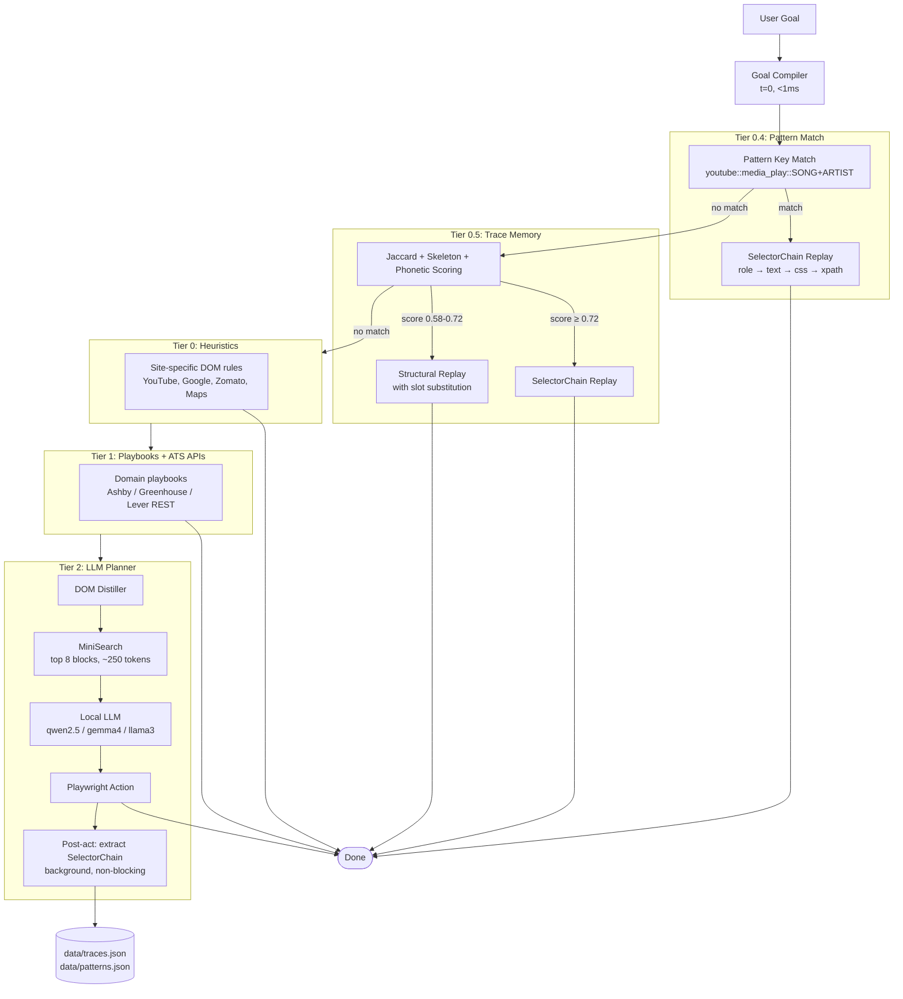

# Stagehand Local 🎭🤖

> **A self-improving local browser agent.** Learns execution paths from the first run, stores them semantically, and replays them instantly for any similar future task — with zero LLM calls on known paths. Runs entirely on your machine with any local OpenAI-compatible model (Ollama, llama.cpp, vLLM, LM Studio).

---

```text
$ npx tsx index.ts --ui --port 7788
🚀 Launching browser: Playwright Chromium (CLEAN mode)...
🌐 Stagehand Web UI active at http://127.0.0.1:7788
   Press Ctrl+C to stop | Close terminal = session keeps running
   Reconnect anytime: npx tsx index.ts --reconnect

🤖 Agent: "play crown by txt on youtube"
   🎯 Goal Plan [t=0]: Service=youtube | Query="crown txt"
[1/10] 📍 "Blank" (about:blank)
   ⚡ Heuristic: Navigated directly to YouTube search for "crown txt"
[2/10] 📍 "crown txt - YouTube"
   ⚡ "click the link 'TXT (투모로우바이투게더) CROWN Official MV'"
[3/10] 📍 "TXT CROWN Official MV - YouTube"
   ⚡ Heuristic: Verified playback of "TXT CROWN Official MV"
🎉 Now playing "TXT CROWN Official MV" on YouTube.
💾 Trace recorded. 🧩 Pattern recorded: "youtube::media_play::SONG+ARTIST"

🤖 Agent: "play millioner by honey singh"   ← new song, different artist, typo
   🧩 Pattern Match! "youtube::media_play::SONG+ARTIST" (0 LLM calls)
   📐 Slots: { SONG: "millioner", ARTIST: "honey singh" }
   🔗 SelectorChain replay via "role" in 287ms
🎉 Now playing "MILLIONAIRE SONG - Yo Yo Honey Singh" on YouTube.

📊 Tier 0 (Heuristic): 4 | Tier 2 (LLM): 1 | LLM Calls Skipped: 4
```

---

## ⚡ Quick Start

### 1. Install
```bash
npm install
npx playwright install chromium
```

### 2. Configure LLM (`config.json`)
```json
{
  "llm": {
    "baseURL": "http://127.0.0.1:11434/v1",
    "modelId": "qwen2.5:7b",
    "stepTimeoutMs": 90000
  }
}
```

### 3. Run
```bash
npm run ui                          # Web UI at http://127.0.0.1:7788
npm run cli                         # Interactive terminal REPL
npx tsx index.ts "your task here"   # One-shot CLI
```

### 4. Session management
```bash
npx tsx index.ts status             # Is a session running? Show URL
npx tsx index.ts --reconnect        # Reopen the running session in browser
```
> **Closing the terminal doesn't kill the session.** The process survives `SIGHUP` and keeps serving the Web UI. Use `Ctrl+C` to actually stop it.

---

## 🧠 How It Works: The Self-Improving Path Library

The core idea: **paths are the optimization, not APIs.**

Most browser agents call an LLM on every step. Stagehand Local learns from every run and builds a library of execution paths that gets faster and more reliable over time.

### The Learning Loop

```
First run:  "play crown by txt"
  → LLM plans → executes → succeeds
  → POST-ACT: extract stable selectors (role, css, aria) — not XPath
  → Pattern stored: youtube::media_play::SONG+ARTIST
  → Trace stored with SelectorChain

Every run after: "play [any song] by [any artist]"
  → Pattern match (structural) → 0 LLM calls
  → Slot matching: "millioner" ≈ "millionaire" via phonetic (Jaro-Winkler + Metaphone)
  → Navigate directly → SelectorChain click (role→text→css→xpath)
  → If DOM changed: self-heals to next working selector level
```

### Tier Hierarchy

```
Tier 0.4  Pattern Replay     <5ms    0 LLM   Exact structural pattern key match
Tier 0.5  Trace Replay       ~1s     0 LLM   Stored path + SelectorChain
Tier 0    Heuristics         ~500ms  0 LLM   Site-specific DOM rules
Tier 1    Playbooks          ~1s     0-1 LLM Domain shortcuts + ATS APIs
Tier 2    LLM Planner        5-15s   2-5 LLM Full agent loop (first time only)
```

### SelectorChain — Semantic Selectors That Survive Redesigns

Paths store **semantic descriptions** of elements, not structural XPaths:

```
role: { role: "link", name: "CROWN Official MV" }  ← survives any DOM restructure
text: "CROWN"                                        ← human-readable fallback
css:  "ytd-video-renderer a#video-title"            ← YouTube's own stable ID (5+ years)
xpath: "/html/body/ytd-app/..."                     ← last resort only
```

Replay tries `role` first. If YouTube redesigns and `role` fails, tries `text`, then `css`, then `xpath`. Whichever works gets saved as `lastWorking` — next run skips straight to it. **Self-healing, zero LLM required.**

### Slot Matching — Fuzzy/Phonetic Without ML Models

```
"millioner" → Metaphone → MLNR
"millionaire" → Metaphone → MLNR
→ Match score: 0.95 ✅ (threshold: 0.72)
```

Uses `cmpstr` (45KB, zero deps) with algorithm per slot type:
- **song/artist**: Jaro-Winkler + phonetic (Metaphone)
- **restaurant**: Jaro-Winkler + Dice trigram
- **city**: Levenshtein normalized

---

## 🏗️ Full Execution Pipeline



---

## 🖥️ Web UI

Chat-first interface. Conversation on the left, live browser preview on the right.

```bash
npm run ui    # → http://127.0.0.1:7788
```

- **Chat interface** — full conversation history with user/agent bubbles, typing indicator, step pills
- **Live browser preview** — screenshot of what the agent sees, auto-updated on each step
- **Activity log** — timestamped log with color-coded nav/act/done/error lines
- **Mode chips** — Agent / Extract / Batch (inline forms)
- **Browser toggle** — Clean (isolated Chromium) / My Browser (your real browser with cookies)
- **Settings overlay** — LLM endpoint, model, max steps, browser binary path
- **Clear context** — wipes session memory for a fresh start

---

## 🕹️ CLI Reference

```bash
npm run cli     # interactive REPL
```

| Command | Description |
|---|---|
| `@file.pdf` | Attach file to session context (pdf, docx, txt, json, csv, ts, py) |
| `/attach <path>` | Attach file to session memory |
| `/files` | List attached files |
| `goto <url>` | Navigate to URL |
| `act <instruction>` | Perform browser action |
| `extract <instruction>` | Extract data from current page |
| `screenshot` | Capture current page |
| `think <question>` | Ask LLM using session context (0 browser calls) |
| `traces` | Show recorded execution trace library |
| `patterns` | Show learned abstract pattern library |
| `context` | Inspect all stored extractions and answers |
| `/reset` | Clear session memory |
| `scan <csv> <col> "instr" [out.csv]` | Batch extract from CSV |

---

## 🌐 Browser Modes

### Clean Browser (default)
Isolated Playwright Chromium — no accounts, clean cookies. Best for privacy and reliable automation.

### My Browser
Runs with your real browser and all your logged-in sessions, cookies, and saved passwords.

```bash
# Start Arc/Chrome with remote debugging
/Applications/Arc.app/Contents/MacOS/Arc --remote-debugging-port=9222 '--remote-allow-origins=*'
```

Or toggle in the Web UI → **Browser Settings**.

---

## 📦 Persistent Data

| File | Contents |
|---|---|
| `data/traces.json` | Recorded execution traces with SelectorChains |
| `data/patterns.json` | Abstract patterns (URL templates with `{{SLOT}}` placeholders) |
| `data/playbooks.json` | Domain-specific shortcuts and known selectors |
| `data/session.json` | Running session PID + port (cleared on Ctrl+C) |

**All learning is persistent across restarts.** The more you use it, the faster it gets.

---

## ⚙️ Configuration (`config.json`)

```json
{
  "llm": {
    "baseURL": "http://127.0.0.1:11434/v1",
    "apiKey": "not-needed",
    "modelId": "qwen2.5:7b",
    "temperature": 0.1,
    "stepTimeoutMs": 90000
  },
  "browser": {
    "headless": false,
    "defaultTimeout": 30000,
    "useOwnBrowser": false,
    "keepBrowserOpen": true,
    "windowWidth": 1280,
    "windowHeight": 1100
  },
  "agent": {
    "maxSteps": 10,
    "postActionMs": 800,
    "synthesize": true
  }
}
```

### Environment Overrides

| Variable | Description |
|---|---|
| `LLAMA_BASE_URL` | LLM API base URL |
| `MODEL_ID` | LLM model name |
| `USE_OWN_BROWSER` | Use personal browser |
| `BROWSER_PATH` | Browser executable path |
| `BROWSER_USER_DATA` | Browser profile directory |
| `BROWSER_CDP` | Connect via CDP port |
| `MAX_STEPS` | Max agent steps |
| `HEADLESS` | Run headless |

---

## 📊 Performance

### What the tiers actually cost

| Task | Cold (first run) | Warm (path known) |
|---|---|---|
| Play song on YouTube | 8-12s | 3-5s |
| Weather query | 5-8s | ~500ms (wttr.in API) |
| Restaurant hours | 8-15s | 3-5s |
| Google search + extract | 5-8s | 2-4s |

### Per-step cost breakdown (Tier 2)
- DOM distill: ~20ms
- MiniSearch slice: ~5ms (250 tokens fed to LLM vs 20k+ raw AXTree)
- LLM prefill + generation: 1-3s (local 7B model)
- Action execution: 200-400ms
- DOM settle (adaptive): 200-400ms (was fixed 800ms)

---

## 🛡️ Resilience Features

| Feature | What it does |
|---|---|
| **SelectorChain self-healing** | If role selector fails, tries text → css → xpath, updates path |
| **Loop detection + recovery** | Detects repeated actions, asks LLM for a different approach |
| **Final verification** | After goal claims completion, verifies answer is actually correct |
| **Circuit breaker** | On 3 extraction failures on same URL, scrolls or navigates to sub-page |
| **SERP fast-hop** | Jumps directly to first organic result, skips social/low-value domains |
| **Zod self-healing** | Strips LLM reflection artifacts; guarantees valid action schema |
| **Cookie dismissal** | Handles OneTrust, Cookiebot, Klaro banners in <50ms |
| **Ad skip escalation** | YouTube: try skip button → seek to end → wait → LLM fallback |
| **Interstitial recovery** | 4-tier ladder: Escape → click → coordinate click → DOM removal |
| **New-task page guard** | If new task is a different service, clears stale page first |

---

## 🗂️ Code Structure

```
src/
├── planner.ts       Main agent loop — all tiers, post-act selector extraction
├── patterns.ts      Abstract pattern system (regex slot-filling, {{SLOT}} templates)
├── trace.ts         Execution trace library + SelectorChain + replay engine
├── slot-matcher.ts  Semantic slot matching (Jaro-Winkler + Metaphone via cmpstr)
├── heuristics.ts    ~1500 lines of site-specific zero-LLM rules
├── distill.ts       DOM distillation, Zomato/Maps/Google extractors
├── conversation.ts  Session memory, context carry-forward, conversational routing
├── compiler.ts      t=0 goal compiler — extracts service/intent/slots
├── playbook.ts      Domain playbook store and archetype detection
├── session.ts       Process persistence — SIGHUP survival, reconnect
├── server.ts        HTTP server + SSE event stream
├── webui.ts         Chat-first Web UI HTML (~850 lines)
├── cli.ts           Interactive REPL with tab completion
├── llm.ts           LLM client (OpenAI-compatible)
├── browser.ts       Browser session management
├── apis.ts          Direct API helpers (wttr.in, YouTube InnerTube, Places)
data/
├── traces.json      Persistent execution traces
├── patterns.json    Abstract patterns with slot templates
├── playbooks.json   Domain shortcuts and selectors
index.ts             Entry point + CLI flags
```

---

## 🔧 Diagnostics

```bash
npx tsx index.ts precheck   # validate browser config, CDP, binary paths
```

Exit codes for automation pipelines:
| Code | Meaning |
|---|---|
| `0` | Success |
| `1` | Task failed / timeout / step limit |
| `2` | CDP/network error / browser not found |

---

## 🗺️ Roadmap

- [ ] **Path merging** — when two traces share the same skeleton, merge into one richer abstract path
- [ ] **Exponential decay reliability** — YouTube paths degrade faster than GitHub (30d vs 90d half-life)
- [ ] **Background re-learning** — when a trace fails 3× consecutively, trigger LLM re-run in background
- [ ] **Phonetic slot substitution in replay** — use JW+phonetic when filling slots in stored trace instructions

---

## 📜 License

ISC License. Built on top of [Stagehand](https://github.com/browserbasehq/stagehand) by Browserbase.
