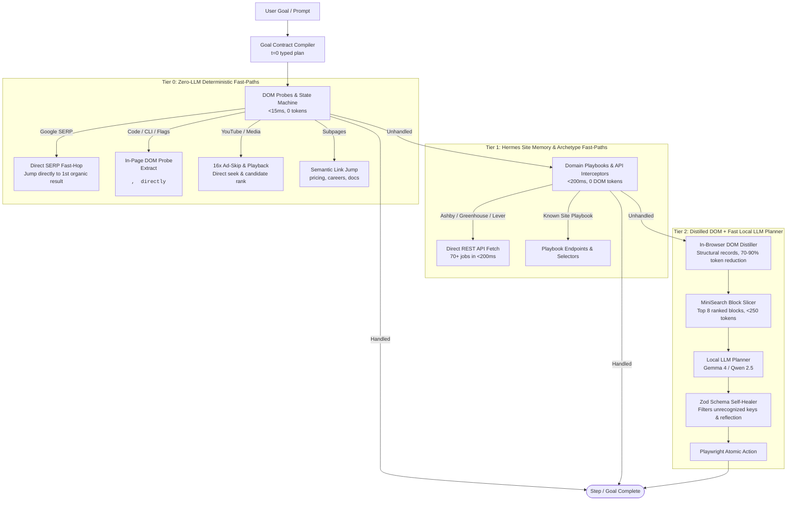

# Stagehand Local 🎭🤖

> **Autonomous browser agent with a three-tier execution pipeline** — zero-LLM fast paths, ATS API shortcuts, and distilled DOM extraction that cuts token usage 70–90% vs. raw HTML or full AXTree dumps. Runs on any local OpenAI-compatible model (`llama-server`, Ollama, vLLM, LM Studio).

---

```text
$ npx tsx index.ts "find Vitest getting started guide and extract the CLI command for test coverage"

🚀 Launching browser...
🧠 LLM: unsloth/gemma-4-26B-A4B-it-GGUF:UD-IQ4_XS @ http://127.0.0.1:8080/v1
[1/10] 📍 "Blank" -> https://www.google.com/search?q=Vitest+getting+started+guide
       ⚡ Heuristic: Direct SERP fast-hop to https://v1.vitest.dev/guide/ (0 tokens, 85ms)
[2/10] 📍 "Getting Started | Vitest" (https://v1.vitest.dev/guide/)
       🔍 In-page DOM probe matched code snippet: "vitest run --coverage" (0 tokens, 12ms)

🎉 The CLI command used to run test coverage in Vitest is `vitest run --coverage`.

📊 [Execution Stats] Tier 0 (Heuristic): 2 | Tier 1 (Playbook): 0 | Tier 2 (LLM): 0 | LLM Calls Skipped: 2
⏱️ Total Time: 3.42s
```

---

## ⚡ Quick Start

### 1. Install Dependencies & Chromium
```bash
npm install
npx playwright install chromium
```

### 2. Verify Your Local LLM Endpoint (`config.json`)
Point `config.json` at your local inference server (e.g. `llama-server`, Ollama, vLLM, LM Studio):
```json
{
  "llm": {
    "baseURL": "http://127.0.0.1:8080/v1",
    "modelId": "unsloth/gemma-4-26B-A4B-it-GGUF:UD-IQ4_XS",
    "stepTimeoutMs": 120000
  }
}
```

### 3. Launch

```bash
# Web UI Dashboard (real-time execution steps, live screen viewer, settings)
npm run ui
# → Open http://127.0.0.1:7788

# OpenCode-style Interactive Terminal REPL (tab completion, @file attachments)
npm run cli

# One-shot command from terminal
npx tsx index.ts "https://news.ycombinator.com what is the #1 story right now?"
```

---

## 🎯 When to Use vs. When NOT to Use

| ✅ Ideal Use-Cases | ❌ Not Built For |
|---|---|
| **Privacy-First Workflows**: Local documents (resumes, specs, candidate lists) never leave your machine. | **Heavy CAPTCHA Farms**: Sites protected by Cloudflare Turnstile, DataDome, or Arkose that require CAPTCHA-solving farms. |
| **Batch CSV Extraction**: High-volume web scraping across 100+ sites with zero cloud API token costs. | **Multi-Factor Auth (MFA)**: Complex enterprise logins requiring manual mobile authenticator prompts. |
| **Documentation & Technical Search**: Extracting commands, pricing tables, and docs with zero-token in-DOM probes. | **Infinite Cloud Budgets**: Teams with unrestricted cloud budgets willing to pay $0.05+ per browser action step. |
| **Job & ATS Pipelines**: Intercepting Lever, Greenhouse, and Ashby to pull 100+ listings in <200ms via direct REST APIs. | **Pixel-Perfect Canvas / WebGL Games**: Applications with zero standard DOM or semantic text elements. |

---

## 🏗️ Three-Tier Execution Pipeline

Most browser agents pass the entire DOM or a massive 20,000-token Accessibility Tree (AXTree) to an LLM on every interaction step. On local hardware, prefilling thousands of tokens takes 15–30 seconds per step, burns KV-cache memory, and triggers timeouts.

Stagehand Local solves this with a **three-tier execution pipeline** where the LLM is the last resort, not the first:



### Tier Breakdown

1. **Tier 0: Zero-LLM Fast-Paths (`<15ms`, `0 tokens`)**
   - **Google SERP Fast-Hop**: Bypasses the search engine page entirely by hopping directly to the first clean organic result URL.
   - **In-Page DOM Code Probe**: Queries asking for CLI commands, coverage flags, or install snippets (`vitest run --coverage`, `npm install`) probe `<pre>`, `<code>`, and `.language-bash` directly in the DOM.
   - **16x Playback Ad Acceleration**: Accelerates video ads to 16x speed and dismisses overlays in ~312ms.
   - **Semantic Target Navigation**: Jumps straight to `/pricing`, `/careers`, or `/docs` with target verification and automatic rollback guards.

2. **Tier 1: Hermes Site Memory & Archetypes (`<200ms`, `0 DOM tokens`)**
   - **Master ATS API Fast-Path**: Intercepts modern ATS platforms (**Ashby**, **Greenhouse**, **Lever**) and fetches all open roles via direct public REST APIs, skipping DOM rendering entirely.
   - **Persistent Playbooks (`data/playbooks.json`)**: Remembers domain endpoints, verified selectors, and URL shortcuts across sessions.
   - **Archetype Fingerprinting**: Recognizes site types (Shopify, ATS, Docusaurus) from globals (`window.__NEXT_DATA__`) and auto-inherits extraction strategies.

3. **Tier 2: Distilled DOM + Fast Local LLM Planning (`1–2s`)**
   - **In-Browser DOM Distillation (`distillPage`)**: Extracts structured record containers (`tr`, `article`, `[class*="card"]`) and strips noise (`nav`, `footer`).
   - **MiniSearch Block Slicing (`rankDistilledBlocks`)**: Indexes page blocks in-memory and passes only the top **8** ranked blocks (**<250 tokens** vs. 20,000+ raw AXTree tokens) to Gemma 4 / Qwen.
   - **Zod Self-Healing**: Strips model reflection artifacts and unallowed keys, guaranteeing zero `unrecognized_keys` crashes.

---

## 🧩 Core Capabilities & Resilience

| Feature | Description | Impact |
|---|---|---|
| **Parse-Time Attachment Validation** | Validates `@file` and natural language references before planner step 1 | Stops runs immediately on missing attachments; prevents 10-step thrashing loops |
| **Direct ATS Fast-Paths** | Intercepts Lever, Ashby, and Greenhouse by org slug | Fetches 70+ jobs via direct REST API in <200ms at 0 DOM tokens |
| **Strict Zod Self-Healing** | Sanitizes schema echoes, unallowed keys, and type mismatches | Eliminates schema crashes on quantized local models |
| **Zero-LLM Cookie Dismissal** | In-page DOM evaluator dismisses consent banners in <50ms | Saves 1–2 LLM calls per page; route-blocks OneTrust, Cookiebot, Klaro |
| **DOM Distillation & Slicing** | Extracts container-first records; MiniSearch slices top 8 blocks | Slashes prompt payloads 70–90% (<250 tokens), 10x faster prefill |
| **Destination-Verified Semantic Nav** | Verifies URL/title alignment after navigation; auto-rolls back if mismatched | Eliminates navigation misfires (e.g. docs vs. contact page) |
| **Fact-Pinning Context Manager** | Locks attached files and extractions; prunes transient chit-chat | Retains critical reference context across long sessions |
| **Universal Interstitial Recovery** | 4-tier ladder (Escape → Action Click → Coordinate Click → DOM Guillotine) | Clears blocking modals, popups, and countdown overlays |
| **Delta-State 16x Ad Acceleration** | Speeds up video ads to 16x playbackRate + native hardware-level clicks | Clears 5s countdowns in ~312ms and 15s unskippable ads in ~900ms |
| **Anti-Repeat Circuit Breakers** | Detects repeated empty actions on the same page | Breaks dead-end loops by forcing subpage navigation or scroll reveals |

<details>
<summary><b>🔬 Deep Architectural & Technical Mechanics (Click to expand)</b></summary>

### 1. In-Browser Structural Container Extraction (`distillPage`)
Runs inside the browser via `page.evaluate()` in ~10–25ms:
- **Container-First Extraction**: Targets logical records (`tr`, `li`, `article`, `[role="row"]`, `[class*="card"]`) so composite data (title + author + comments + score) remains atomic.
- **Table Cell Alignment**: Formats table rows with `col1 | col2 | col3` cell separators for local LLM tabular reasoning.
- **Child Deduplication**: Skips headers, `<nav>`, `<footer>`, and nested children whose parent record was already captured.
- **Universal Visible Text Fallback**: If container extraction yields <150 characters, automatically falls back to clean visible text from `main`, `#content`, or `document.body`.

### 2. MiniSearch Pre-Extraction Slicing (`rankDistilledBlocks`)
- Indexes distilled text blocks in an in-memory full-text search index (`prefix: true`, `fuzzy: 0.2`).
- Preserves natural DOM document order (`id`) so rankings, table rows, and narrative context are never scrambled.
- Slices the top 8 ranked blocks into `fastExtract()`, reducing input context to ~180–250 tokens for sub-2-second generation on 26B quantized models.

### 3. Parse-Time Attachment Precondition Guard
- Scans user prompts for `@filename` or explicit natural-language file references (`based on the attached spec.txt`).
- Distinguishes email addresses (`support@stripe.com`) from file references.
- Auto-attaches local files found on disk; triggers an immediate hard stop with a clean error message if referenced attachments are missing, preventing impossible tasks from burning execution steps.

### 4. Semantic Destination Verification (`verifySemanticDestination`)
- After clicking a semantic link (pricing, docs, careers), verifies that destination URL and `<title>` match the intended target.
- Rejects error pages, 404s, and dead-ends (<100 characters of text).
- Reverts invalid jumps via `page.goBack()`, records the domain target in `navigatedSemanticTargets`, and returns `null` so LLM planning takes over from the original page.

### 5. Universal Interstitial Recovery Protocol
- Probes viewport center with `document.elementFromPoint()` to detect fixed/absolute high-z overlays and blocking modals.
- Detects countdown timers ("Skip in 5s") and waits until skip buttons become interactive.
- Escalates through a 4-tier recovery ladder: keyboard `Escape` → action button click → geometric corner-coordinate click → surgical DOM removal (`overflow = "auto"`).

</details>

---

## 🖥️ Web UI Dashboard

Run `npm run ui` (or `npx tsx index.ts --ui --port 7788`) to launch the built-in Web UI dashboard:

- 🌐 **Browser Environment Radio Toggle**: Toggle between **Clean Browser** (isolated Playwright sandbox) and **My Default Browser** (runs with all your real logged-in sessions, cookies, and profiles from Google Chrome, Arc, Brave, or Edge with zero locking conflicts).
- 🤖 **Agent Goal Runner**: Submit natural language instructions and stream step-by-step execution logs (`navigate`, `click`, `extract`, `done`) via Server-Sent Events (SSE).
- 📸 **Live Screen Viewer**: Automatic and manual snapshot refresh showing the exact live state of the automated Chromium browser.
- 🔍 **Quick Extract**: Single-click URL data extraction with immediate markdown synthesis.
- 📋 **Batch CSV Scanner**: Upload and run CSV URL lists with real-time table progress and downloadable CSV output.
- ⚙️ **Hot-Reload Settings**: Modify LLM endpoint, model ID, browser binary paths, timeouts, and settling delays directly from the UI without restarting.

---

## 🕹️ Interactive CLI (OpenCode-Style REPL)

Run `npm run cli` for a high-ergonomics developer terminal:

### 📎 Attaching Files & Tab Autocompletion (`@`)
Type `@` and press `Tab` to search and attach local workspace files:
```text
[about:blank] > think evaluate @spec.txt against @package.json
📎 Attached "spec.txt" (450 words / 2.8 KB) to session context.
📎 Attached "package.json" (69 words / 0.7 KB) to session context.
```
- **Supported Formats**: `.pdf` (via bundled `pdf-parse`), `.docx`/`.rtf` (macOS textutil), `.txt`, `.md`, `.json`, `.csv`, `.ts`, `.js`, `.py`.
- **Workspace Indexing**: Indexes files while automatically ignoring `node_modules`, `.git`, `.next`, etc.

### 📖 CLI Command Reference

| Command | Syntax | Description |
|---|---|---|
| **`@file`** | `@resume.pdf` / `think @file` | Attach file inline to session context |
| **`/attach`** | `/attach <path>` | Attach file directly to session memory |
| **`/files`** | `/files` | List all currently attached files and word counts |
| **`/edit`** | `/edit` / `/e` | Draft/edit multi-line prompt in external `$EDITOR` (`nano`, `vim`, `code`) |
| **`/paste`** | `/paste` / `"""` | Dedicated multi-line capture block (submit with `"""` or `EOF`) |
| **`goto`** | `goto <url>` | Navigate the current page to the specified URL |
| **`act`** | `act <instruction>` | Perform a browser action (`act click on the Apply button`) |
| **`extract`** | `extract <instruction>` | Extract specific data or text from the current page |
| **`observe`** | `observe [instruction]` | Discover interactive DOM elements and their selectors |
| **`screenshot`** | `screenshot [file.png]` | Capture a PNG screenshot of the current page |
| **`think` / `ask`** | `think <question>` | Query the LLM using accumulated session context (0 browser calls) |
| **`context`** | `context` | Inspect all stored extractions, answers, and documents |
| **`scan`** | `scan <csv> <col> "instr" [out.csv]` | Batch scan URLs from a CSV file |
| **`pages`** | `pages` | List all open browser tabs and URLs |
| **`back`** | `back` | Navigate back in browser history |
| **`save`** | `save [file.txt]` | Save the last extraction or answer to disk |
| **`exit`** | `exit` / `quit` / `q` | Close browser and quit |

---

## 📊 Batch CSV Scanning

Automate data extraction across hundreds of websites via CLI or Web UI:

```text
Stagehand> scan outreach.csv careers_url "Are there open remote engineering roles? List titles." results.csv
```

- Reads `outreach.csv`.
- Navigates each URL in column `careers_url`.
- Dismisses cookie overlays, attempts Tier 1 ATS direct API fast-paths, and extracts target fields.
- Appends clean structured output into `results.csv` in real-time.

---

## ⚙️ Configuration Reference (`config.json`)

```json
{
  "llm": {
    "baseURL": "http://127.0.0.1:8080/v1",
    "apiKey": "not-needed",
    "modelId": "unsloth/gemma-4-26B-A4B-it-GGUF:UD-IQ4_XS",
    "temperature": 0.1,
    "stepTimeoutMs": 90000
  },
  "browser": {
    "headless": false,
    "defaultTimeout": 30000
  },
  "agent": {
    "maxSteps": 10,
    "maxRetries": 2,
    "domSettleMs": 1500,
    "postActionMs": 800,
    "synthesize": true,
    "contextWindowChars": 24000
  },
  "shortcuts": {
    "youtube": "https://www.youtube.com/results?search_query={{query}}",
    "google": "https://www.google.com/search?q={{query}}",
    "github": "https://github.com/search?q={{query}}&type=repositories",
    "hn": "https://hn.algolia.com/?q={{query}}",
    "npm": "https://www.npmjs.com/search?q={{query}}"
  },
  "cookieDismiss": [
    "Accept all",
    "Accept all cookies",
    "Accept cookies",
    "I agree",
    "Got it",
    "Allow all",
    "Close"
  ]
}
```

### Environment Variable Overrides

| Variable | Description | Example |
|---|---|---|
| `HEADLESS` | Run browser in headless mode (`true` / `false`) | `HEADLESS=true` |
| `LLAMA_BASE_URL` | Override LLM base API URL | `LLAMA_BASE_URL=http://localhost:11434/v1` |
| `MODEL_ID` | Override LLM model name | `MODEL_ID=unsloth/gemma-4-26B-A4B-it-GGUF:UD-IQ4_XS` |
| `MAX_STEPS` | Max agent steps before terminating | `MAX_STEPS=15` |

---

## 🛠️ Diagnostics & POSIX Exit Codes

When called as a subprocess in automation pipelines, Stagehand Local adheres to standard exit codes:

| Exit Code | Classification | Condition |
|---|---|---|
| `0` | **Success** | Instruction successfully resolved, extraction returned, or navigation complete. |
| `1` | **Failure / Timeout** | Browser action failed, empty extraction, step limit reached, or anti-loop circuit breaker triggered. |
| `2` | **CDP / Network Error** | Playwright Chromium binary missing, CDP protocol error, websocket failure, or connection refused. |

---

## 📜 License

ISC License. Built on top of [Stagehand](https://github.com/browserbasehq/stagehand) by Browserbase.
